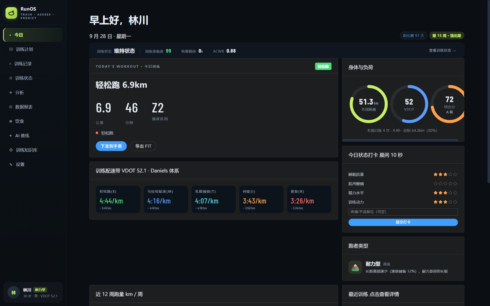
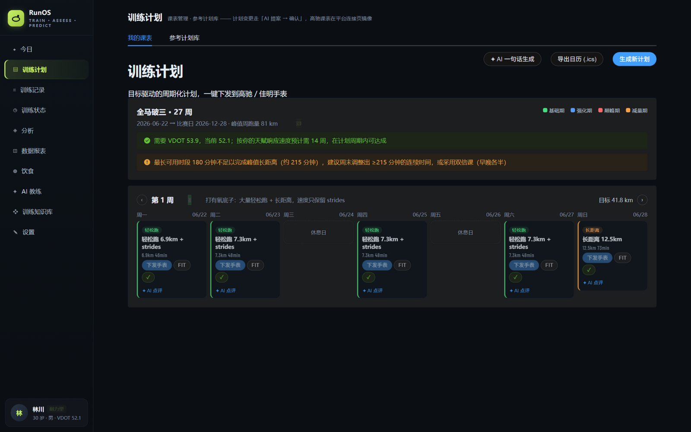
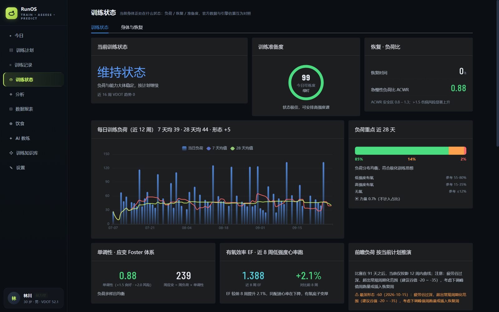
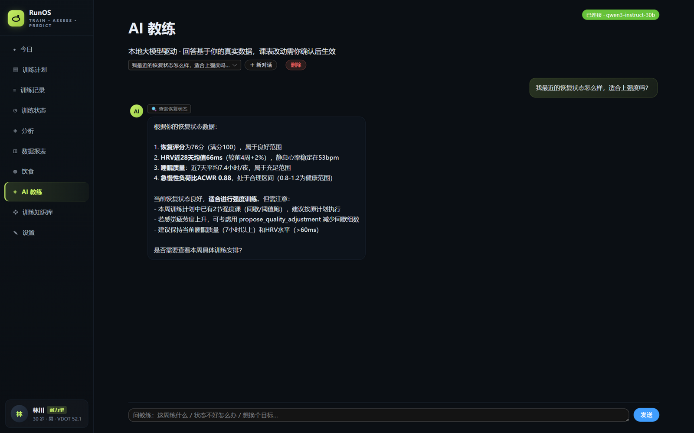

# RunOS

[](https://github.com/printing10101/RunOS/actions/workflows/tests.yml)
[](https://github.com/printing10101/RunOS/actions/workflows/privacy-guard.yml)
[](LICENSE)

A local-first training platform for runners. It syncs your training and body data from COROS, Garmin and Strava, builds periodized training plans around your calendar and race goals, pushes structured workouts back to your watch, and ships an AI coach that runs entirely on your own machine — no cloud, no subscription, your data never leaves your computer.

**中文文档见 [README.zh-CN.md](README.zh-CN.md)。**

## Screenshots

| Today | Training plan |
| --- | --- |
|  |  |
| **Training status** | **AI coach** |
|  |  |

## Highlights

- **One place for everything** — COROS / Garmin / Strava adapters with incremental auto-sync (default every 30 min). Activities with splits, pace/HR curves, elevation, GPS tracks, heart-rate zones and running dynamics; daily HRV, sleep, resting HR, weight, SpO2 and more.
- **Serious training science** — Daniels VDOT, Riegel with personal calibration from race results, critical-speed model with R² fit quality, ACWR / CTL / ATL / TSB load management, Foster monotony & strain, aerobic decoupling, 12-week forward load projection, race-day form prediction.
- **Plans that fit your life** — goal-driven periodized plans (base / build / peak / taper) that avoid your busy calendar slots, with structured steps exportable to Apple/Google/Outlook calendars (.ics), Garmin and Strava as structured workouts, or generic FIT files.
- **A coach that proposes, you confirm** — the local LLM (llama.cpp) answers data questions through 26 query tools, and may *propose* schedule changes, interval adjustments or goal updates as cards you review before anything is written. All numbers come from deterministic engines, never from the model.
- **Daily readiness** — a morning check-in (sleep, soreness, energy, motivation, pain) maps to an advice band, combined with objective signals (HRV vs. an automatically maintained 28-day rolling baseline, sleep debt, fueling status).
- **Gear, races, diet, strength** — shoe mileage and replacement reminders, race-result logging with predicted-vs-actual debrief, meal logging with on-device nutrition estimation, 1RM strength assessment and runner-specific muscle-balance advice.

## Quick start (Windows)

Prerequisites: [Python](https://www.python.org/downloads/) 3.10+ (3.14 tested) and [Node.js](https://nodejs.org/) 18+.

```bat
git clone https://github.com/printing10101/RunOS.git
cd RunOS
start.bat
```

`start.bat` installs backend dependencies and builds the frontend on first run, starts the API on `http://127.0.0.1:8000` and opens your browser. Close the backend window to stop.

There is also a desktop shell (`desktop/desktop.py`, pywebview): a native window that brings the service up with it and shuts it down gracefully when closed.

**Just want to look around?** Load a synthetic 27-week training history:

```bat
cd backend
python seed_demo.py    # refuses to touch an existing database; --force reseeds
```

### Linux / macOS

The one-click entry points are Windows-only, but the backend is a standard FastAPI app:

```bash
cd backend && pip install -r requirements.txt && python run.py   # 127.0.0.1:8000
cd web && npm install && npm run build                           # built SPA served by the API
```

## Connecting your platforms

| Platform | How | Notes |
| --- | --- | --- |
| **COROS** | Official [Build on COROS MCP](https://github.com/coroslab/COROS-MCP) channel — click "官方接口接入" on the Connections page and authorize. **No API keys needed** (dynamic OAuth client registration). Set `COROS_REGION` in `backend/.env`. | Activities + daily body metrics. Workout *push* not yet available via MCP (FIT export works). |
| **Garmin** | Community library `garminconnect` with your Garmin Connect account (`GARMIN_EMAIL` / `GARMIN_PASSWORD` in `backend/.env`). | Unofficial, personal use only — endpoints may break with upstream changes. |
| **Strava** | Free personal app at [strava.com/settings/api](https://www.strava.com/settings/api); set the callback to `http://localhost:8000/api/connections/strava/callback`. | Best source for per-point GPS/HR data (COROS list API omits it). |

Details in [docs/integration-guide.md](docs/integration-guide.md). Manual entry works fine without any connection.

## Local AI coach (optional)

Everything works without AI; the coach simply falls back to rule-based advice. To enable it you need [llama.cpp](https://github.com/ggml-org/llama.cpp)'s `llama-server` and one GGUF model (Qwen3-8B / Qwen3-14B `Q4_K_M` is a good starting point):

1. Put `llama-server.exe` somewhere and a `.gguf` model file next to it.
2. In `backend/.env` set `AI_MODEL_PATH` (absolute path to the GGUF) and `AI_LLAMA_DIR` (llama.cpp folder). See `backend/.env.example` for every option.
3. Restart the platform. The AI coach page shows "已连接" when the model is up — the server is started with the platform and stopped when you close it, freeing VRAM.

Design principle: **the LLM proposes, the engine computes, you confirm.** The model never invents paces, loads or predictions — it calls query tools backed by the VDOT / zones / planner engines, and any plan change arrives as a proposal card that is re-validated server-side before it touches your plan.

## Development

```bash
cd backend && python -m pytest -q        # ~470 tests
python -m ruff check .                   # from the repo root
cd web && npm test && npm run lint       # vitest + eslint
```

CI runs the backend suite on Windows (the platform's target OS), plus frontend tests, lint and [privacy scanning](tools/privacy_guard.py). If you contribute, install the local privacy hooks too — they block personal data (GPS traces, device IDs, credentials) from ever being committed:

```bash
git config core.hooksPath githooks
```

## Documentation

- [docs/algorithms.md](docs/algorithms.md) — scoring, prediction and load algorithms
- [docs/integration-guide.md](docs/integration-guide.md) — platform integration details

## Disclaimer

Race predictions, talent assessment and career-ceiling estimates are engineering approximations built on public models (Daniels, Riegel, critical speed) and statistical heuristics — they roll with your data and are **not** medical or professional coaching advice. Training-status metrics approximate vendor methodologies (TRIMP load, Karvonen zones, Minetti cost-of-grade). The Garmin path uses an unofficial community API.

## License

[MIT](LICENSE)
